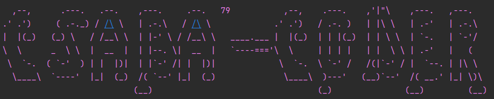

# api-first-development i.e. Contract First Development

## Contract first development using Swagger API

Backend part of the project!

Using: http://localhost:8080 for the project!

In service see as follows:

Database in case of dev and prod: MyQL Server (environment variables set for project, pls. user your own!)

Environment Variables as follows: DB_PORT, DB_URL, DB_USER, DB_PASSWORD

In case of test: H2 in memory database used (see application.properties for setup under test folder)